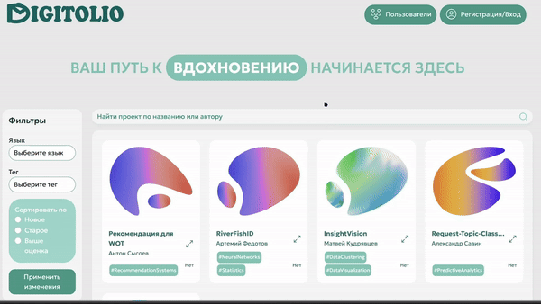
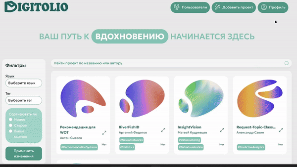
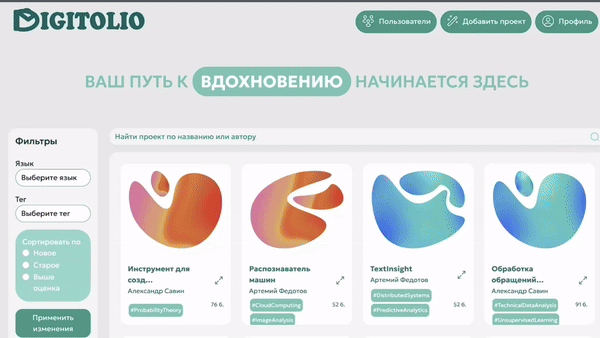
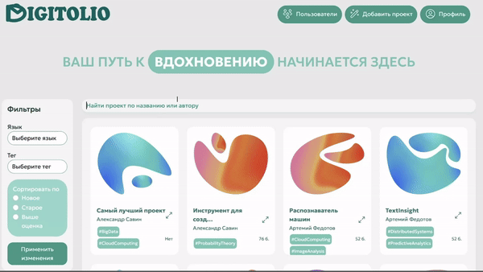
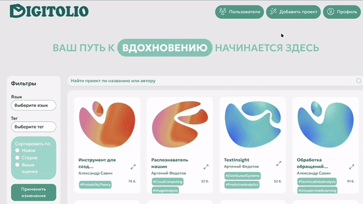
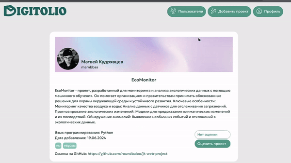
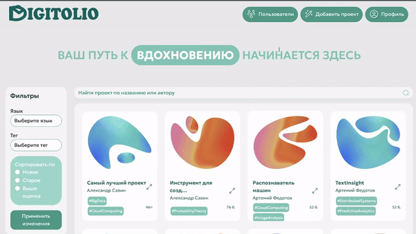

# Digitolio: Платформа для организации и оценки студенческих проектов

## Описание проекта

**Digitolio** — это веб-платформа, разработанная для управления и оценки студенческих проектов в рамках курса "Введение в инженерную деятельность" под руководством Мясникова Филиппа Сергеевича.

## Проблемы и Решения

### Основные Проблемы

1. **Неэффективные процессы:** 
   - Отсутствие единого специализированного сервиса.
   - Недостаточная функциональность существующих платформ.
   - Увеличение количества проектов и студентов при ограниченном времени на проверку.

### Решение

Создание веб-сервиса, который позволяет:
- Загружать и структурировать проекты по учебным командам.
- Оценивать проекты преподавателями.
- Обеспечивать доступ к реализованным проектам для вдохновения и примеров.

## Технологический стек

### Основной фреймворк

**Django** был выбран по следующим причинам:

- **Встроенный функционал:**
  - ORM (Object-Relational Mapping)
  - Административная панель
- **Масштабируемость:** Возможность эффективного расширения функциональности.
- **Быстрая связь представлений с бизнес-логикой:** Оперативное реагирование на изменения и требования пользователей.
- **Архитектурный шаблон MTV (Model-Template-View):** Упрощение организации и структурирования кода.

### База данных

- **SQlite3:** Легковесная реляционная база данных.

### Интерфейс пользователя

- **Bootstrap:** Фреймворк для быстрой и адаптивной разработки интерфейсов.
- **jQuery:** Библиотека для упрощения работы с DOM и AJAX.

### Контроль версий

- **Git:** Система контроля версий для отслеживания изменений и совместной работы.
- **GitHub:** Платформа для хостинга репозиториев и командного взаимодействия.

## Основные функции

### Регистрация и Аутентификация

- Пользователь нажимает на кнопку регистрации и заполняет форму.
- Валидация данных происходит на стороне сервера.
- В случае ошибки выводится сообщение с предложением повторить процедуру.

 

### Личный кабинет

- Редактирование профиля с сохранением изменений в базе данных.
- Управление проектами: создание, редактирование, удаление.

### Лента проектов

- Просмотр мини-версий проектов на главной странице.
- Расширенный просмотр с дополнительной информацией.

- Фильтрация и поиск по названию, тегам, дате добавления и учебной группе.

### Загрузка проектов

- Студенты могут загружать проекты.
- Имеется возможность настройки полей проекта.

### Оценка проектов

- Преподаватели могут ставить оценки.
- Просмотр и анализ результатов оценки.

### Список пользователей

- Просмотр списка пользователей.
- Фильтрация пользователей.

## Преимущества платформы

1. **Универсальность:** Поддержка различных типов проектов и данных.
2. **Интеграция:** Возможность интеграции с внешними сервисами и API.
3. **Безопасность:** Использование современных методов защиты данных.
4. **Производительность:** Оптимизация запросов и кэширование.
